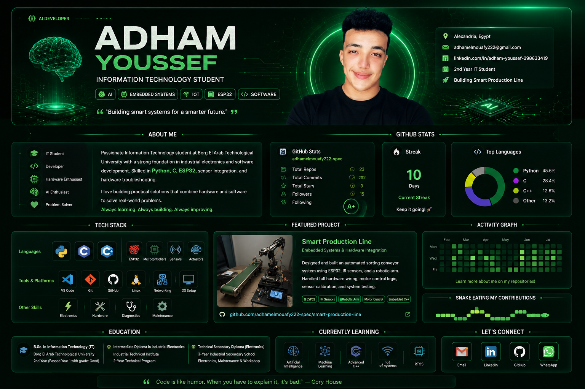

<div align="center">




<br/>


<br/><br/>

<a href="#-about-me">About</a> ·
<a href="#-tech-stack">Stack</a> ·
<a href="#-featured-work">Projects</a> ·
<a href="#-github-analytics">Stats</a> ·
<a href="#-lets-connect">Contact</a>

<br/>

<p>

<a href="mailto:adhamelmouafy222@gmail.com">

</a>

<a href="https://github.com/adhamelmouafy222-spec">

</a>

<a href="https://linkedin.com/in/adham-youssef-298633419">

</a>

</p>


</div>

---

# 👨‍💻 About Me

```yaml
name:        Adham Youssef
role:        AI & Embedded Systems Developer
education:   Information Technology Student
location:    Alexandria, Egypt
speciality:  ESP32 • IoT • AI
project:     Smart Production Line
mission:     Building intelligent embedded systems.
```
---

# 🛠 Tech Stack

<table width="100%">
<tr>

<td width="50%" valign="top">

### 💻 Programming Languages


<br><br>

### 🌐 Web Development


<br><br>

### ⚡ Embedded Systems


</td>

<td width="50%" valign="top">

### 🤖 AI & IoT


</td>

</tr>
</table>

---

# 🚀 Featured Work

## 🏭 Smart Production Line

AI-powered Smart Production Line using ESP32.

### Features

- ESP32 Controller
- IR Sensors
- DC Motors
- Automation
- AI Decision Making
- Real-Time Monitoring

### Technologies

`ESP32`
`Arduino`
`C++`
`IoT`
`Automation`

---

# 📊 GitHub Analytics

<div align="center">


</div>

<div align="center">


</div>

---

# 🐍 Contribution Snake

<div align="center">


</div>

---

# 📫 Let's Connect

<div align="center">

<a href="mailto:adhamelmouafy222@gmail.com">

</a>

<a href="https://linkedin.com/in/adham-youssef-298633419">

</a>

<a href="https://github.com/adhamelmouafy222-spec">

</a>

</div>

---

<div align="center">

## 💚 Thanks for visiting my profile!


### 🚀 Building Smart Production Line with AI, ESP32 & IoT

⭐ **If you like my work, don't forget to star my repositories!**

</div>
